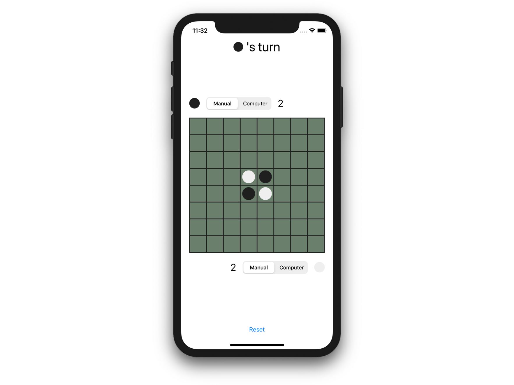
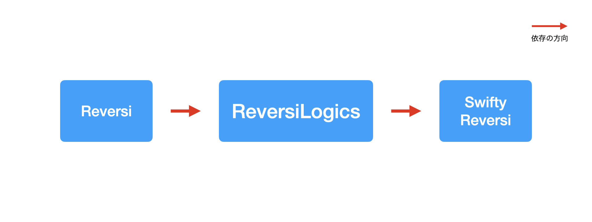
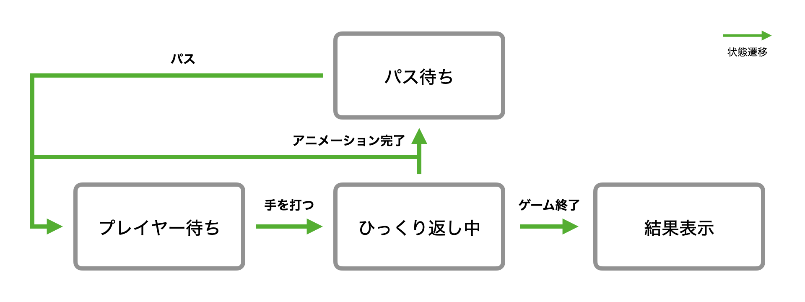
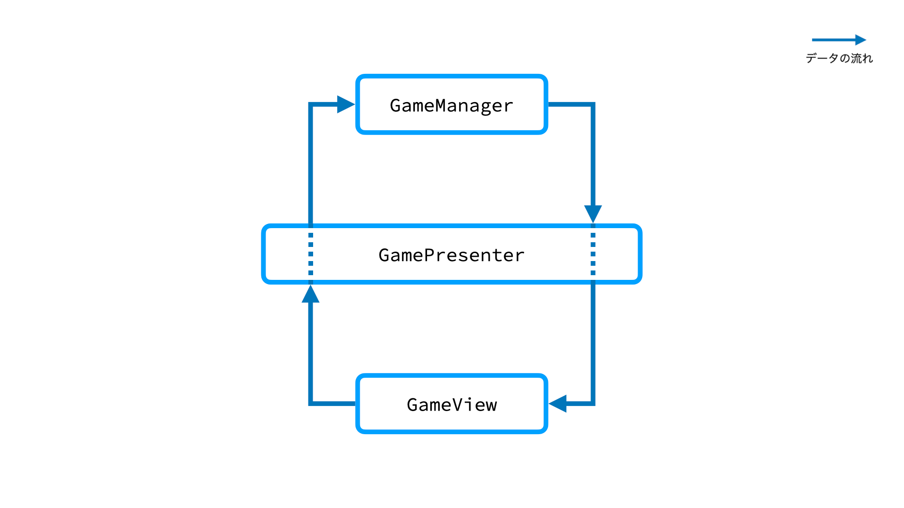

# SwiftUIで作るリバーシアプリ

本リポジトリは[リバーシ](https://ja.wikipedia.org/wiki/%E3%82%AA%E3%82%BB%E3%83%AD_(%E3%83%9C%E3%83%BC%E3%83%89%E3%82%B2%E3%83%BC%E3%83%A0))の iOS アプリを SwiftUI で実装したものです。

## アプリの構成

本アプリはコードの依存関係を適切に扱うために、三つのモジュールに分けれられています。

| モジュール | リポジトリ |
|:--|:--|
| `SwiftyReversi` | [koher/swifty-reversi](https://github.com/koher/swifty-reversi) |
| `ReversiLogics` | [koher/reversi-logics-swift](https://github.com/koher/reversi-logics-swift) |
| `Reversi` | 本リポジトリ |

`SwiftyReversi` および `ReversiLogics` は SwiftPM を用いて本リポジトリの Xcode プロジェクトに組み込まれています。モジュールの依存関係は次の通りです。

### `SwiftyReversi`

Swift で実装された汎用的リバーシライブラリです。本アプリの仕様から独立しており、 [Clean Architecture](https://blog.cleancoder.com/uncle-bob/2012/08/13/the-clean-architecture.html) の Entity に該当します。

### `ReversiLogics`

`SwiftyReversi` と違い、アプリ特有のロジックを実装するレイヤーです。ただし、 UI やファイル I/O などからは独立しているため、テストが記述しやすくなっています。

内部的には `UseCases` と `Presenters` の二つのモジュールに分かれています。前者は `GameManager` が、後者は `GamePresenter` が中心的な役割を果たします。

`GameManager` はアプリの状態遷移を扱っており、たとえば下図は `playState` で表される状態の遷移を表したものです。

`GamePresenter` は `GameManager` と UI を仲介し、必要に応じてデータを変換します。

### `Reversi`

SwiftUI で実装されたアプリ本体です。 `ReversiApp` がエントリーポイントで、 `GameView` がメインの `View` です。 `GameView` が `GamePresenter` を介して `GameManager` を保持し、それによって UI と状態管理のロジックのインタラクションを実現しています。

`GamePresenter` は `GameView` からの入力と `GameManager` からの出力を仲介しますが、入力と出力は干渉しないため一方向のデータフローが実現されています。

## UIKit との連携

本アプリは [refactoring-challenge/reversi-ios](https://github.com/refactoring-challenge/reversi-ios) の実装例の一つです。 refactoring-challenge/reversi-ios は UIKit で実装された `BoardView`, `CellView`, `DiskView` を提供しています。本アプリではそれぞれ `_BoardView`, `_CellView`, `_DiskView` としてリネームした上で取り込み、 `UIViewRepresentable` を用いて SwiftUI 用のラッパーを提供することで `GameView` から利用しています。